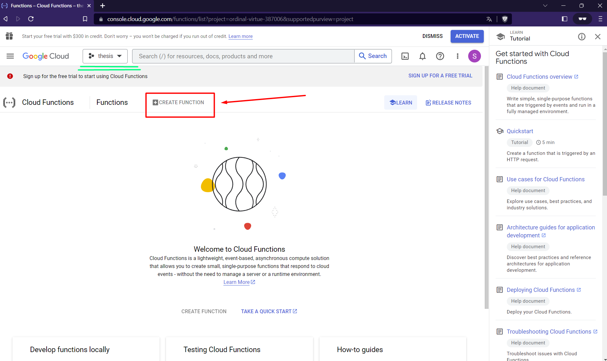

# GCP - Cloud Functions

This document explains how to create a server function on GCP.

<!-- TABLE OF CONTENTS -->
<details>
  <summary>Table of Contents</summary>
  <ol>
    <li>
      <a href="#about">About</a>
    </li>
    <li>
      <a href="#getting-started">Getting Started</a>
        <li><a href="#prerequisites">Creating a server function</a></li>
        <li><a href="#settings">Server function settings
</a></li>
    </li>
    <li><a href="#testing">Testing the function</a></li>
    <li><a href="#resources">Resources</a></li>
  </ol>
</details>

### Getting Started

1. Create an account on [Google Cloud Platform](https://console.cloud.google.com/). \
**NOTE:** it seems like IAAC uses GCP, so if you use your university email you might be able to skip inserting your card details. \
*Even if you are using your private account and insert your card details, GCP has a [free tier](https://cloud.google.com/free), which means you have a free usage of different services within certain limits. For [Cloud Functions](https://cloud.google.com/free/docs/free-cloud-features#cloud-functions) the limit is **2 million calls*** :smile:
1. Look at the website:
\


<p align="right">(<a href="#readme-top">back to top</a>)</p>

### Creating a server function

1. On GCP all resources should be collected under a *project* - think about it as a folder that has all the things related to one project (images, files, functions etc). Create a new project:

1. Give your project a name (e.g. ```thesis```) and choose an organization (can be ```No organization``` as well). Click on ```Create project```.
1. When the project is created you get a notification:

1. Go to the menu on the left side. There is an **extremely long** list of all the different GCP products and services. Click on ```More products``` to expand it even more :no_mouth: and choose ```Cloud Functions``` under the section ````Serverless```. You can pin the product - it will be more comfortable accessing it later.

1. Select your project to create a function inside it:

1. Now you should be able to see your project on the top. Click on ```Create new function```. \
**NOTE:** it will be unclickable if you don't have a payment method connected to it. You would need to link a card to it - but you should not be charged unless you go over the [free limit](https://cloud.google.com/free). For this click on ```Billing``` on the left side. \
**ANOTHER NOTE:** New users receive $300 credits to use on GCP for 3 months (which is quite a lot). You could activate them instead. \
 
 


<p align="right">(<a href="#readme-top">back to top</a>)</p>

### Server function settings

1. With all the setup made you should be able to see the window where you set the parameters for the cloud functions. For our scope (website) it should be accessible by anybody, so the settings are:
    * ```name``` - choose any name for your function
    * ```Àllow unauthenticated invocations``` - it means that anyone can call the function. This project does not have privacy restrictions.
    * ```Require HTTPS``` - uncheck 
    * Click on ```Save```, then ```Next```

1. Now time to write the function. Let's choose Python (any version you need) in the code editor.

1. After that Google **already provides** the minimum needed files and code for the function. It can be deployed already, but let's modify it a bit.
1. Click on ```requirements.txt``` and add ```Flask``` to it. ```requirements.txt``` is a file that indicates which python packages you are using. You do not need to install them yourself, only write the names. They will be installed for you with ```pip``` when the function becomes activated.

1. We can create more files. For that click on the ```+``` sign and write a new file's name, ```utils.py```:


1. Let's add an utility function to ```utils.py``` that would construct a response for our function. In this way the main code will only give it the resulting dictionary and the ```build_response``` function will do the rest.\
Add these lines to the file (or copy the contents of [utils.py](https://github.com/STASYA00/iaacCodeAndDeploy/blob/main/src/utils.py) and paste them here):
    ```
    from flask import make_response

    def build_response(content, status_code: int = 200):
        response = make_response({"content": content}, status_code)
        response.headers.add("Access-Control-Allow-Origin",
                            "*")
        response.headers.add('Access-Control-Allow-Headers', "*")
        response.headers.add('Access-Control-Allow-Methods', "*")
        return response
    ```
    
1. The last step: modifying ```main.py```. First, make sure the name of your function is the same as the Entry point above the code editor. This is the function that gets executed every time a request is sent to your server:

1. Replace the ```return``` in the default code by ```res``` - or give your variable any name you like. ```res``` is the **input** that is sent to your function in the following format: \
    ```{"message": input}``` \
We replace ```return``` with ```res``` to be able to do something with the input
    Your code becomes:
    ```
    def hello_world(request):
        request_json = request.get_json()
            if request.args and 'message' in request.args:
                res = request.args.get('message')
            elif request_json and 'message' in request_json:
                res = request_json['message']
            else:
                res = f'Hello World!'
    ```
1. Add a line that constructs a response to the function:
    ```
    return build_response(res)
    ```
    Function returns a dictionary in the following format:
    ```{"content": result}```, where ```result``` is what you send in ```build_response``` function

1. Now the code looks like this:


1. The only thing left to be done is to write what you want to do with the input - in between the blue and the green blocks :fire:

1. A simple example could be adding a string to the input we receive (but make sure your input is a string :neutral_face:): ```res += " another string"```

1. The entire function can be found [here](https://github.com/STASYA00/iaacCodeAndDeploy/blob/main/src/get_result.py)
1. The requirements file can be found [here](https://github.com/STASYA00/iaacCodeAndDeploy/blob/main/src/requirements.txt)

1. Click on ```Deploy```

<p align="right">(<a href="#readme-top">back to top</a>)</p>


### Testing the function

1. When the function is ready to be used a :heavy_check_mark: appears near it.
1. Go to the ```Permissions``` tab, select ```Grant access```

1. In the panel write ```allUsers``` and select ```Cloud Functions``` -> ```Cloud Function Invoker``` as a role. It means that literally anyone can call the function.

1. The result should look like this:

1. ```Save```
1. Go to the ```TESTING``` tab, next to ```PERMISSIONS```. Click on ```TEST THE FUNCTION```

1. Testing with different input:


<p align="right">(<a href="#readme-top">back to top</a>)</p>

### Resources

* [GCP console](https://console.cloud.google.com)
* [Free resources on GCP](https://cloud.google.com/free)
* [Cloud Functions limits](https://cloud.google.com/free/docs/free-cloud-features#cloud-functions)
* [Cloud Functions docs](https://cloud.google.com/functions/docs)
*  [Cloud Functions How-To Guides](https://cloud.google.com/functions/docs/how-to)
* [GCP tutorials - different products of GCP](https://www.cloudskillsboost.google/journeys)

<p align="right">(<a href="#readme-top">back to top</a>)</p>
