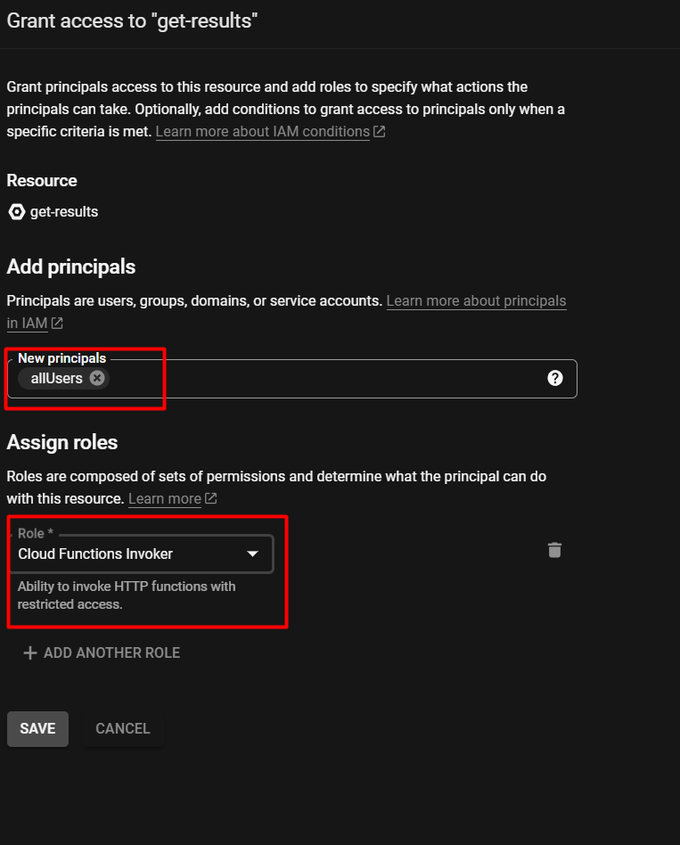

# GCP - KMeans from a .csv

This document explains how to create a server function that outputs the results of clustering (or other data processing algorithm with `sklearn`) on GCP.

__What we are doing__: 

* taking a ready `.csv` file, e.g. with the urban data 
* storing it on the cloud
* reading the data from the `.csv` into the server function
* performing `Kmeans` clustering on the data

__Prerequisites:__
* GCP account - [here's]((https://github.com/STASYA00/iaacCodeAndDeploy/blob/main/GCP.md)) how to create one;
* a project on GCP - refer to the link above to create a project if you don't have one
* server function on GCP - refer to the link above to create a simple function if you don't have one
* `.csv` file to read from - or use a [sample file](https://github.com/STASYA00/iaacCodeAndDeploy/blob/main/assets/POI_200.csv)

<!-- TABLE OF CONTENTS -->
<details>
  <summary>Table of Contents</summary>
  <ol>
    <li>
      <a href="#getting-started">Getting Started</a></li>
        <li><a href="#store-the-file">Store the file</a></li>
        <li><a href="#set-up-cloud-function">Set up cloud function</a></li>
    <li><a href="#permissions">Permissions</a></li>
    <li><a href="#read-csv-from-the-bucket">Read .csv from the bucket</a></li>
    
    <li><a href="#adding-kmeans">Adding Kmeans</a></li>
    <li><a href="#resources">Resources</a></li>
  </ol>
</details>

### Getting Started

1. If you haven't already, [create](https://github.com/STASYA00/iaacCodeAndDeploy/blob/main/GCP.md) an account and a simple cloud function on [Google Cloud Platform](https://console.cloud.google.com/). 

1. There are different types of storages on GCP. Here we will be using [Cloud Storage](https://cloud.google.com/storage). It is [__free to use__](https://cloud.google.com/free/docs/free-cloud-features#storage) up to 5GB of storage in us-central1, us-east1 and us-west1 regions.\
Select it in the menu:
\


<p align="right">(<a href="#readme-top">back to top</a>)</p>

### Store the file

1. Files in the storage are collected under a *bucket* - think about it as a folder for your files. Create a new bucket:

1. Give your bucket a name (e.g. ```thesis_files_2938479234``` - the name should be unique across the entire platform). Choose `Region` for `Where to store your data` option.

1. Press `Continue` in the popup window.
1. The bucket is ready! The interface is similar to the folders on your local computer. Files can be uploaded, deleted, renamed.

1. Upload the `.csv` - you can use [sample file](https://github.com/STASYA00/iaacCodeAndDeploy/blob/main/assets/POI_200.csv) borrowed from [Karim](https://github.com/KarimAbillama) :smile:

1. The file is uploaded:


<p align="right">(<a href="#readme-top">back to top</a>)</p>


### Set up Cloud Function

1. Let's create a new function (detailed instruction [here](https://github.com/STASYA00/iaacCodeAndDeploy/blob/main/GCP.md))\
Choose Python - the version your project uses
Add ```utils.py```, ```requirements.txt``` and ```main.py``` from the [folder](https://github.com/STASYA00/iaacCodeAndDeploy/blob/main/src/function_kmeans) \
    <details>
    <summary>TL;DR Files explanation</summary>

    * ```requirements.txt``` - file where you specify the python packages that your project uses. Each line specifies a package and will be run with ```pip install PACKAGE``` - like you do in colab. Here there is no need to run this command, only to specify the packages you are using. \
        _These packages are installed every time the function is evoked, so it is better to limit their amount - this way the function will run faster._
     * ```utils.py``` - utility functions I have written to simplify the main function.
        * ```get_request_input``` parses the input you send when calling the endpoint. ```res, status_code = get_request_input(request, "content")``` returns ```res``` as the parameter you have sent. \
                __NOTE:__ the information is sent as ```{"content": "parameter"}``` - make sure you change ```"content"``` to your key if you sent the parameter in another way
        * ```build_response``` - formats the output (the information you want to send back) from your function
        * In between those two you can process the input to become the output - that's where your code goes. \
                __NOTE:__ no visual functions here. All the ```plt.show```, boxplots, scatters, ```img.show()``` etc __SHOULD NOT__ be here.
    *  ```main.py``` - here we specify the function that is called by the server, our main code.

    </details>

    
    
<p align="right">(<a href="#readme-top">back to top</a>)</p>

### Permissions

Files in the bucket are protected from public access (security 🙂), which means that cloud function has no access to them. We would need to grant it a permission to do it.

1. Go to the ```Details``` section of the cloud function. Copy the name of the associated _service account_. This is the account that _acts_ in the name of this function, it will be this account who needs the access to the bucket.

2. Go to your bucket, click on it and choose the ```Permissions``` tab. Such tab exists on most of the GCP products, it is generally the place to grant access to someone. Click on ```Grant Access```

3. In ```Principal``` paste the service account address you have just copied:

4. In ```Roles``` click on the ```Cloud Storage``` 

5. assign the following roles to your service account, one by one:

6. Save. Make sure you see these roles in the ```Permissions``` tab now.


<p align="right">(<a href="#readme-top">back to top</a>)</p>

### Read .csv from the bucket

1. Get the path of your ```.csv``` on GCP. For that _in a separate tab_ go to the bucket we have created earlier, click on the ```POI_200.csv``` (or the file you used) and copy the path:


1. Read ```.csv``` file into ```pandas``` dataframe. Change ```FILEPATH``` for the path of your bucket file, e.g. ```gs://csv_urban_data_098765/POI_200.csv```
    ```
    CSV_PATH = "FILEPATH"

    fs = gcsfs.GCSFileSystem(project='my-project') # reading csv from the bucket
    with fs.open(CSV_PATH) as f:
        df = pd.read_csv(f)
        
    print(df.columns) # - this line logs the results in the Logs of the cloud function.
    ```
    [_Source_](https://stackoverflow.com/a/50201179)

    <details><summary> Code at this point </summary>
    
    ```
    import pandas as pd

    from utils import *

    def hello_world(request):
        """Responds to any HTTP request.
        Args:
            request (flask.Request): HTTP request object.
        Returns:
            The response text or any set of values that can be turned into a
            Response object using
            `make_response <http://flask.pocoo.org/docs/1.0/api/#flask.Flask.make_response>`.
        """
        res, status_code = get_request_input(request, "content", "H")
        res += " another string"

        CSV_PATH = "FILEPATH"

        fs = gcsfs.GCSFileSystem(project='my-project') # reading csv from the bucket
        with fs.open(CSV_PATH) as f:
            df = pd.read_csv(f)
            
        print(df.columns) # - this line logs the results in the Logs of the cloud function.
        return build_response(res, status_code)
    ```
    </details>
1. Deploy the function to make sure that it works. Test it by clicking on the ```TESTING``` tab when the function is ready.
1. Check the logs. With successful implementation the df's columns are printed:
    

    __NOTE:__ if the dataframe (or the packages) is too big, you might encounter a memory error:
    

    In this case consider either removing unnecessary packages or increasing the memory in the Function's settings: Click on ```Edit function``` and increase the memory:
    
1. Ready!

<p align="right">(<a href="#readme-top">back to top</a>)</p>


### Adding KMeans

1. Let's add data processing code to the function.\
__NOTE: no visual functions here.__ All the ```plt.show```, boxplots, scatters, ```img.show()``` etc __SHOULD NOT__ be here. All of it belongs to the frontend, where the result is actually _visualized_.
1. ```df``` in the code is the usual dataframe. Let's add data processing to it:
    ```
    columns_to_exclude = ["PLOT_ID", "X", "Y"]
    # Karim's preprocessing:
    df = df.drop[columns_to_exclude]
    df = df.fillna(df.mean())
    scaler = MinMaxScaler()
    df = pd.DataFrame(scaler.fit_transform(df),columns=df.columns)
    print(df.head())
    ```
    <details><summary> Code at this point </summary>
        
        ```
        import gcsfs
    import pandas as pd
    from sklearn.cluster import KMeans
    from sklearn.preprocessing import MinMaxScaler

    from utils import *

    def hello_world(request):
        """Responds to any HTTP request.
        Args:
            request (flask.Request): HTTP request object.
        Returns:
            The response text or any set of values that can be turned into a
            Response object using
            `make_response <http://flask.pocoo.org/docs/1.0/api/#flask.Flask.make_response>`.
        """
        res, status_code = get_request_input(request, "content", "H")
        res += " another string"

        CSV_PATH = "gs://csv_urban_data_098765/POI_200.csv"
        fs = gcsfs.GCSFileSystem(project='my-project')
        with fs.open(CSV_PATH) as f:
            df = pd.read_csv(f)
            
        print(df.columns)
        columns_to_exclude = ["PLOT_ID", "X", "Y"]
        

        # Karim's preprocessing:
        df = df.drop(columns=columns_to_exclude)
        df = df.fillna(df.mean())
        scaler = MinMaxScaler()
        df = pd.DataFrame(scaler.fit_transform(df),columns=df.columns)
        print(df.head())
        
        return build_response(res, status_code)

        ```
    </details>
1. Test the function
1. Add KMeans algorithm to it:
    ```
    km_model = KMeans(n_clusters=10,)
    km_model.fit(df)
    res = km_model.labels_ # res is np.array

    # numpy array can not be sent back. 
    # It needs to be converted to a list of int first:
    res = [int(x) for x in res]  # list<int>
    ```
    <details><summary> Code at this point </summary>
        
    ```
    import gcsfs
    import pandas as pd
    from sklearn.cluster import KMeans
    from sklearn.preprocessing import MinMaxScaler

    from utils import *

    def hello_world(request):
        """Responds to any HTTP request.
        Args:
            request (flask.Request): HTTP request object.
        Returns:
            The response text or any set of values that can be turned into a
            Response object using
            `make_response <http://flask.pocoo.org/docs/1.0/api/#flask.Flask.make_response>`.
        """
        res, status_code = get_request_input(request, "content", "H")
        res += " another string"

        CSV_PATH = "gs://csv_urban_data_098765/POI_200.csv"
        fs = gcsfs.GCSFileSystem(project='my-project')
        with fs.open(CSV_PATH) as f:
            df = pd.read_csv(f)
            
        print(df.columns)
        columns_to_exclude = ["PLOT_ID", "X", "Y"]
        

        # Karim's preprocessing:
        df = df.drop(columns=columns_to_exclude)
        df = df.fillna(df.mean())
        scaler = MinMaxScaler()
        df = pd.DataFrame(scaler.fit_transform(df),columns=df.columns)
        print(df.head())
        km_model = KMeans(n_clusters=10,)
        km_model.fit(df)
        res = km_model.labels_# res is np.array

        # numpy array can not be sent back. 
        # It needs to be converted to a list of int first:
        res = [int(x) for x in res]  # list<int>
        
        return build_response(res, status_code)

        ```
        </details>
1. The result should look like this:

1. Test the function.
1. Test the function in <a href="https://colab.research.google.com/github/STASYA00/iaacCodeAndDeploy/blob/main/src/notebooks/Test_GCF.ipynb" target="_parent"></a>. Replace ```"URL"``` with the url of your function, e.g. ```'https://us-central1-project.cloudfunctions.net/function'```.


<p align="right">(<a href="#readme-top">back to top</a>)</p>

### Resources

* [GCP console](https://console.cloud.google.com)
* [Free resources on GCP](https://cloud.google.com/free)
* [Cloud Storage limits](https://cloud.google.com/free/docs/free-cloud-features#storage)
* [Cloud Storage docs](https://cloud.google.com/storage/docs)
* [Read csv from Cloud Storage](https://stackoverflow.com/a/50201179)
* [GCP tutorials - different products of GCP](https://www.cloudskillsboost.google/journeys)

<p align="right">(<a href="#readme-top">back to top</a>)</p>
