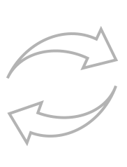

<!-- Improved compatibility of back to top link: See: https://github.com/STASYA00/iaacCodeAndDeploy/pull/73 -->
<a name="readme-top"></a>

[![Contributors][contributors-shield]][contributors-url]
[![Forks][forks-shield]][forks-url]
[![Stargazers][stars-shield]][stars-url]
[![Issues][issues-shield]][issues-url]
[![MIT License][license-shield]][license-url]
[![LinkedIn][linkedin-shield]][linkedin-url]


<!-- PROJECT LOGO -->
<br />
<div align="center">
  <a href="https://github.com/STASYA00/iaacCodeAndDeploy">
    
    
  </a>

  <h3 align="center" IAAC: Code Architecture Basics & Model Deployment </h3>

  <p align="center">
    IAAC: Code Architecture Basics & Model Deployment.
    <br />
    <a href="https://colab.research.google.com/github/STASYA00/iaacCodeAndDeploy/blob/main/ModelDeployment.ipynb">View Demo</a>
    ·
    <a href="https://github.com/STASYA00/iaacCodeAndDeploy/issues">Report Bug</a>
    ·
    <a href="https://github.com/STASYA00/iaacCodeAndDeploy/issues">Request Feature</a>
  </p>
</div>


<!-- TABLE OF CONTENTS -->
<details>
  <summary>Table of Contents</summary>
  <ol>
    <li>
      <a href="#about-the-project">About The Project</a>
      <ul>
      <li><a href="#intro">Intro</a></li>
        <li><a href="#built-with">Built With</a></li>
      </ul>
    </li>
    <li>
      <a href="#getting-started">Getting Started</a>
      <ul>
        <li><a href="#prerequisites">Prerequisites</a></li>
        <li><a href="#usage">Usage</a></li>
      </ul>
    </li>
    <li><a href="#license">License</a></li>
    <li><a href="#contact">Contact</a></li>
    <li><a href="#acknowledgments">Acknowledgments</a></li>
  </ol>
</details>


<!-- ABOUT THE PROJECT -->
## About The Project

Part of the workshop dedicated to model deployment and code architecture basics.

**Length:** approx. 1.5 hours.
**Prerequisites:** basic knowledge of python (you should know how to write functions, be able to work with the primitives such as ```str```, ```list```, ```int```, ```dict```) and import packages.
**In the end of the workshop:** you should be able to write basic classes, enumerators, know how to run a FastAPI server in colab environment and Flask locally.

### Intro

Most people that enter into data science and programming from completely unrelated fields often take long time to learn
how to code in object-oriented fashion or how to bring their code into production. Usually projects end up being Google Slides presentations even if they could make a cool app.

This tutorial aims to introduce the basics of good coding practices (OOP) and get the students acquainted with server model deployment.

<p align="right">(<a href="#readme-top">back to top</a>)</p>


### Built With


* [python](https://www.python.org/)
* [Flask](https://flask.palletsprojects.com/en/2.3.x/)
* [FastAPI](https://fastapi.tiangolo.com/)
* [Colab](https://colab.research.google.com/)

<p align="right">(<a href="#readme-top">back to top</a>)</p>


<!-- GETTING STARTED -->
## Getting Started

Open the ```ModelDeployment.ipynb``` in [colab](https://colab.research.google.com/github/STASYA00/iaacCodeAndDeploy/blob/main/ModelDeployment.ipynb)

### Prerequisites
None
<p align="right">(<a href="#readme-top">back to top</a>)</p>
<!-- USAGE EXAMPLES -->
### Usage

* Run the cells one by one
* Read the comments
* Do the exercises
* *If possible:* read through the linked resources :smile:
* Write **OOP-only code** in the future

<p align="right">(<a href="#readme-top">back to top</a>)</p>

<!-- LICENSE -->
## License

Distributed under the MIT License. See `LICENSE.txt` for more information.

<p align="right">(<a href="#readme-top">back to top</a>)</p>


## Contact

Stasja - [@stasya00](https://stasyafedorova.wixsite.com/designautomation) - [e-mail](mailto:0.0stasya@gmail.com) - [LinkedIn][linkedin-url]

<p align="right">(<a href="#readme-top">back to top</a>)</p>


<!-- ACKNOWLEDGMENTS -->
## Acknowledgments

* [Angelos Chronis](https://iaac.net/dt-team/angelos-chronis) and [Serjoscha Düring](https://iaac.net/dt-team/serjoscha-duering/) - the professors leading the workshop and defining the scope
* [IAAC](https://iaac.net/) - the university hosting the workshop
* [My favorite README template](https://github.com/othneildrew/Best-README-Template)

<p align="right">(<a href="#readme-top">back to top</a>)</p>


<!-- MARKDOWN LINKS & IMAGES -->
<!-- https://www.markdownguide.org/basic-syntax/#reference-style-links -->
[contributors-shield]: https://img.shields.io/github/contributors/STASYA00/iaacCodeAndDeploy.svg?style=for-the-badge
[contributors-url]: https://github.com/STASYA00/iaacCodeAndDeploy/graphs/contributors
[forks-shield]: https://img.shields.io/github/forks/STASYA00/iaacCodeAndDeploy.svg?style=for-the-badge
[forks-url]: https://github.com/STASYA00/iaacCodeAndDeploy/network/members
[stars-shield]: https://img.shields.io/github/stars/STASYA00/iaacCodeAndDeploy.svg?style=for-the-badge
[stars-url]: https://github.com/STASYA00/iaacCodeAndDeploy/stargazers
[issues-shield]: https://img.shields.io/github/issues/STASYA00/iaacCodeAndDeploy.svg?style=for-the-badge
[issues-url]: https://github.com/STASYA00/iaacCodeAndDeploy/issues
[license-shield]: https://img.shields.io/github/license/STASYA00/iaacCodeAndDeploy.svg?style=for-the-badge
[license-url]: https://github.com/STASYA00/iaacCodeAndDeploy/blob/master/LICENSE.txt
[linkedin-shield]: https://img.shields.io/badge/-LinkedIn-black.svg?style=for-the-badge&logo=linkedin&colorB=555
[linkedin-url]: https://linkedin.com/in/stanislava-fedorova
[product-screenshot]: assets/screenshot.png


